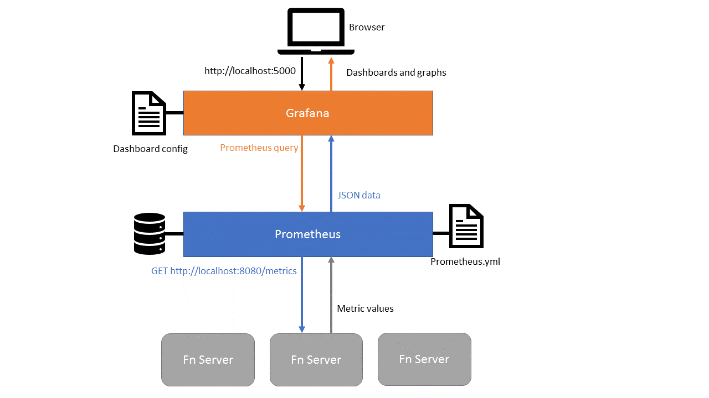
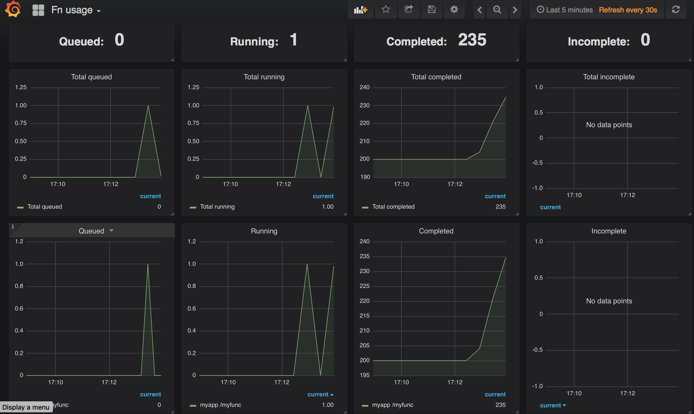
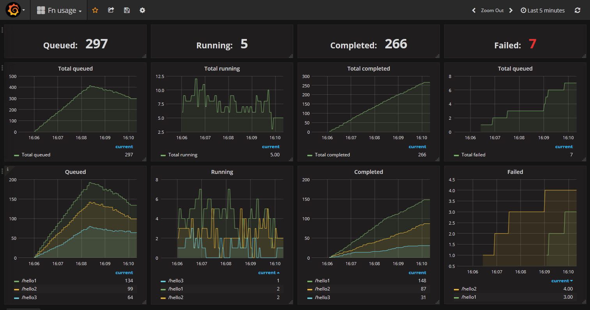
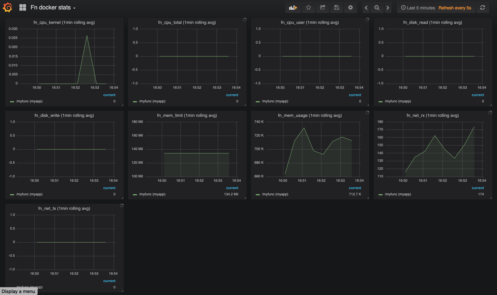

# Display Fn runtime metrics using Prometheus and Grafana

This tutorial is based on [Nigel Deakin's "Announcing Prometheus Metrics from Fn" blog post](https://medium.com/fnproject/announcing-prometheus-metrics-from-fn-2d0f9ddf0f09).

The Fn server exposes metrics i.e. information about it's performance and resource consumption. This information can be easily made available to monitoring tools to display and analyze the server performance. In this tutorial we will use popular monitoring tools Grafana and Prometheus to visualize Fn server metrics. 



## Before you begin

* Make sure you have cloned the GitHub repo `fnproject/tutorials`.
* Make sure you are in the folder `<checked-out-dir>/tutorials/grafana` while executing the commands below.
* Make sure you have Docker 17.10 or later installed and running.
* Make sure you have `fn` CLI tool installed. If you don't have `fn` installed, follow the instructions to [**download and install Fn**](../install/README.md).
* Make sure you have `Fn server` up and running. If it's not running, follow the instructions to [**start the Fn server**](../install/README.md).

> As you make your way through this tutorial, look out for this icon . Whenever you see it, it's time for you to perform an action.


## Fn server metrics

Currently Fn provides three sets of metrics. We’ll see all three sets of metrics in action later.

* Function counts: the number of functions that are currently queued or are running, and the number of functions that have completed successfully or failed since the server was last started
* Operation durations: these represent the time taken to perform various operations. In addition to obtaining the time taken to execute a function, you can also obtain finer-grained data such as the time taken to start the docker container in which it runs
* Docker metrics: when Fn executes a function in a Docker container it obtains various statistics from that container, such as CPU and memory usage, and makes them available as Prometheus metrics

Fn server makes metrics available using the API endpoint `/metrics` by default. Although this endpoint is intended for use only by Prometheus, you can invoke it yourself to see how it works.

>
>Point your browser at [http://localhost:8080/metrics](http://localhost:8080/metrics). This will display the metrics in Prometheus format.

So far we have seen the raw metrics data generated by Fn server. Now let's see how to feed this data to Prometheus and then visualize the data using Grafana.

## Introducing Prometheus

[Prometheus](https://prometheus.io/) is a popular open-source systems monitoring tool. It is a server process which scrapes metrics data from servers and makes it available via a query API. It polls the Fn metrics endpoint at periodic intervals and saves the values of each metric in a database. If you’re running multiple Fn servers you can configure Prometheus to scrape them all in turn and combine the data together.

Prometheus has a powerful API and query syntax which can be used to obtain values of these metrics. You can obtain historical values of a metric, suitable for displaying on a graph, or you can perform statistical operations such as summing metric values across multiple labels, calculating rates and performing quantile functions. Prometheus also has a web interface which allows you to see what metrics are available, and try out ad-hoc queries.

## Start Prometheus

Open a terminal window and navigate to the directory containing this example.

>
>```shell
>cd <checked-out-dir>/tutorials/grafana
>```

Download the prometheus.yml from fn/examples/grafana

>
>```shell
>curl -L0 https://raw.githubusercontent.com/fnproject/fn/master/examples/grafana/prometheus.yml > prometheus.yml
>```

Examine the provided Prometheus configuration file:

>
>```shell
>cat prometheus.yml
>```

This shows the contents of `prometheus.yml` file

```
  global:
    scrape_interval:     15s # By default, scrape targets every 15 seconds.

    # Attach these labels to any time series or alerts when communicating with
    # external systems (federation, remote storage, Alertmanager).
    external_labels:
      monitor: 'fn-monitor'

  # A scrape configuration containing exactly one endpoint to scrape:
  # Here it's the Fn server
  scrape_configs:
    # The job name is added as a label `job=<job_name>` to any timeseries scraped from this config.
    - job_name: 'functions'

      # Override the global default and scrape targets from this job every 5 seconds.
      scrape_interval: 5s

      static_configs:
        # Specify all the Fn servers from which metrics will be scraped
        - targets: ['fnserver:8080'] # Uses /metrics by default
```

The last line ` - targets: ... ` specifies the host name and port of the Fn server from which metrics will be obtained. The name `fnserver` used in this example is defined below in the docker command to start Prometheus server. If you are running a cluster of Fn servers then you can specify them all here.

Check output of the following docker command. This is used in subsequent docker commands to map the docker IP address to the hostnames `fnserver` and `prometheus`.


>
>```shell
>docker network inspect bridge -f '&#123;&#123;range .IPAM.Config&#125;&#125;&#123;&#123;.Gateway&#125;&#125;&#123;&#123;end&#125;&#125;'
>```


This should show an IP address like the following:

```
  172.17.0.1
```

Now start Prometheus, specifying the above config file.

>
>```shell
>docker run --rm --name=prometheus -d -p 9090:9090 \
>  -v `pwd`/prometheus.yml:/etc/prometheus/prometheus.yml \
>  --add-host="fnserver:`docker network inspect bridge -f '{{range .IPAM.Config}}{{.Gateway}}{{end}}'`" \
>  prom/prometheus
>```

Note: This command uses the parameter `--add-host` to define a hostname `fnserver` in the docker container and configure it to use the IP address on which the Fn server is listening.

Go to the Prometheus web console in a browser window:

>
>
>Open a browser and go to [http://localhost:9090/graph](http://localhost:9090/graph)

While Prometheus can display tables and graphs of metrics data, it is usually used in conjunction with another popular data visualization tool called Grafana.

## Introducing Grafana

[Grafana](https://grafana.com/) is a popular open source data visualization tool. It is another server process. It has a web interface to create custom dashboards that pull data from Prometheus (using the full power of the Prometheus query API to perform statistical transformations), display multiple metrics using graphical dashboards and can also generate alerts.  

Grafana provides powerful and flexible facilities to create graphs of any metric available to Prometheus. This example provides a ready-made dashboard that displays the numbers of functions that are queued, running, completed and failed. 

Fn comes with a number of pre-defined dashboards which showcase the various metrics provided by the Fn server.

## Start Grafana

From the same terminal window and the same directory as above, start Grafana on port 5000:

>
>```shell
>docker run --name=grafana -d -p 5000:3000 \
>  --add-host="prometheus:`docker network inspect bridge -f '{{range .IPAM.Config}}{{.Gateway}}{{end}}'`" \
>  grafana/grafana
>```

Go to the Grafana web console in a browser window:

>
>
>Open a browser and go to [http://localhost:5000](http://localhost:5000)

Login using the default Grafana credentials:

>
>
>Enter user: `admin` and password: `admin`

## Configure Grafana to pull metrics from Prometheus

Create a datasource to obtain metrics from Prometheus:

>
>* Click on **Add data source** 
>
>In the form that opens:
>* Set **Name** to `PromDS`
>* Set **Type** to `Prometheus`
>* Set **URL** to `http://prometheus:9090` 
>* Set **Access** to `proxy`
>* Click **Add**
>* Click **Save and test**

## Dashboard 1: Function Count Metrics

The `Fn usage` dashboard demonstrates the first type of metric provided by Fn server: function counts.

In the folder `<checked-out-dir>/tutorials/grafana`, download the `fn_grafana_dashboard.json` from `fn/examples/grafana`

>
>```shell
>curl -L0 https://raw.githubusercontent.com/fnproject/fn/master/examples/grafana/fn_grafana_dashboard.json > fn_grafana_dashboard.json
>```

Import the dashboard that displays metrics from the Fn server:

>
>* Go to http://localhost:5000/dashboard/import  
>* Click **Upload .json file** on the top right hand side of the screen and select the file `fn_grafana_dashboard.json` from the folder `<checked-out-dir>/tutorials/grafana`
>* Select the Prometheus data source `PromDS` created above
>* Click **Import**

You should then see the *Fn usage* Grafana dashboard showing `Function counts: queued, running, completed, failed`. Now invoke some function a number of times and see the graphs update. We have provided a sample function in the folder `<checked-out-dir>/tutorials/grafana/myfunc`.

Change directory:

>
>```shell
>cd myfunc
>```
    
Now build and deploy the function:

>
>```shell
>fn deploy --local --app myapp
>```

We have provided a simple script file 'run.bash' in the folder `<checked-out-dir>/tutorials/grafana/myfunc`. This script invokes our function 100 times.

>
>```shell
>bash run.bash
>```

Let it run whilst you watch the graphs update. You will see something like this:



This dashboard shows the four “function count” metrics. From left to right, these are:

* `fn_queued` number of async function calls that are queued
* `fn_running` number of function calls that are currently running
* `fn_completed` number of function calls that have completed successfully
* `fn_failed` number of function calls that have failed

For each type of metric, the dashboard displays two separate graphs, one above the other:

* The graph at the bottom shows the raw data, which by default is subdivided by its app and route (path) labels. So you will see one line for each function
* The graph at the top shows the result of performing a Prometheus `sum` expression that adds together the metric values for each function. So the graph shows just one line, the grand total for all functions

This demonstrates how there is more to using Prometheus than simply displaying a metric. It allows you to perform various statistical transformations on the raw data, performing a `sum` in this case.

Below is a **sample** `Fn usage` Grafana Dashboard showing multiple functions over a longer time duration: 



## Dashboard 3: Docker Statistics Metrics

The `Fn docker stats` dashboard demonstrates the third type of Prometheus metric provided by Fn server: docker statistics.

In the folder `<checked-out-dir>/tutorials/grafana`, download the `fn_grafana_dashboard3.json` from `fn/examples/grafana`

>
>```shell
>curl -L0 https://raw.githubusercontent.com/fnproject/fn/master/examples/grafana/fn_grafana_dashboard3.json > fn_grafana_dashboard3.json
>```

Import this dashboard in Grafana:

>
>* Go to http://localhost:5000/dashboard/import  
>* Click **Upload .json file** on the top right hand side of the screen and select the file `fn_grafana_dashboard3.json` from the the folder `<checked-out-dir>/tutorials/grafana`
>* Specify the Prometheus data source `PromDS` created above
>* Click **Import**

You should then see the `Fn docker stats` Grafana dashboard showing `Docker statistics`. Once again when you first display this dashboard it will display just one graph. Use the pull-down list at the top to select which particular `docker stats` metrics you desire. 

To view the available `Fn docker stats` metrics:

>
>```shell
>curl  --silent http://localhost:8080/metrics | grep 'Metric fn_docker_stats'
>```

And you will see the following metrics:

* `fn_docker_stats_fn_cpu_kernel`
* `fn_docker_stats_fn_cpu_total`
* `fn_docker_stats_fn_cpu_user`
* `fn_docker_stats_fn_disk_read`
* `fn_docker_stats_fn_disk_write`
* `fn_docker_stats_fn_mem_limit`
* `fn_docker_stats_fn_mem_usage`
* `fn_docker_stats_fn_net_rx`
* `fn_docker_stats_fn_net_tx`

Note: In the Grafana dashboard we strip out the prefix `fn_docker_stats` from the metric name. This behaviour is defined in the dashboard JSON file.

Now run the script file 'run.bash' in the folder `<checked-out-dir>/tutorials/grafana/myfunc`. This script invokes our function 100 times.

>
>```shell
>bash run.bash
>```

Let it run while you watch the graphs update. All the metrics have the labels `fn_path` and `fn_appname` set to the route/path and application e.g. `/myfunc (myapp)` in the legend below each graph. You will see something like the following:



>Note: If the container runs for a very short time there may be insufficient time to obtain statistics before the container terminates. So you may not see any metrics if your function is very quick and hence gives docker insufficient time to obtain the statistics before the container running your function shuts down.
 
Below is a **sample** `Fn docker stats` Grafana Dashboard showing multiple functions over a longer time duration: 


## Summary

Congratulations! You have a working set up of Fn Grafana dashboards integrated with Prometheus and Fn server metrics. You can leave the setup running and keep checking the dashboards as you work on other tutorials. 

## Learn more

* Check the Grafana documentation to create your own custom dashboards to display the data that is important to you
* If you enable tracing in the Fn server you can analyse these tracing spans using Zipkin. The same tracing spans are also used to generate duration metrics for Prometheus

**Go:** [Back to Contents](../README.md) and proceed to the next tutorial.

